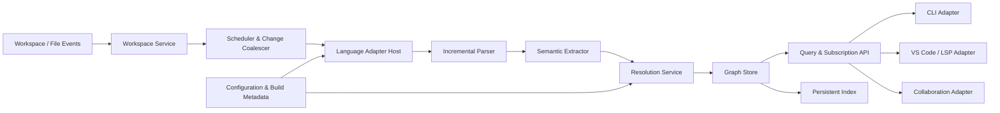
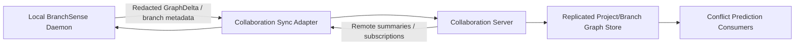

# BranchSense Architecture

**Status:** Foundation design  
**Audience:** Contributors, maintainers, extension authors, and integrators  
**Scope:** Semantic project understanding and incremental graph maintenance. This document intentionally defines no feature implementation.

## 1. Intent and design principles

BranchSense is a local-first semantic analysis platform for software repositories. Its initial responsibility is to keep a current semantic model of a workspace: files, syntax, symbols, references, and dependencies. Future products—conflict prediction, editor experiences, and collaboration—consume that model; they do not own it.

BranchSense is not an AI coding assistant. The core is deterministic, inspectable, and usable offline. AI may be offered later as an optional consumer of exported facts, never as a dependency of parsing, indexing, graph maintenance, or correctness decisions.

The architecture is governed by these principles:

1. **Local-first, deterministic core.** A repository can be analyzed without a network connection or remote service.
2. **Incremental by default.** A change updates its semantic impact set, not the whole workspace.
3. **Stable contracts, replaceable implementations.** Packages depend on narrow interfaces and capability declarations rather than concrete parser, storage, transport, or UI libraries.
4. **Language-neutral model.** Language adapters translate source semantics into a shared graph vocabulary without reducing language-specific detail.
5. **Single-writer graph ownership.** Graph mutation is serialized; query paths are lock-free or snapshot-based.
6. **Bounded latency.** Interactive updates target under 100 ms at p95 for common local edits in an indexed workspace. Work that cannot meet that budget is scheduled as deferred refinement.
7. **Observable correctness.** Every graph fact has provenance, revision metadata, and invalidation behavior.
8. **No platform coupling in the kernel.** CLI, VS Code, and server integrations are adapters around the same engine.

## 2. System overview

BranchSense is organized into a small kernel and ports/adapters around it.



The **kernel** consists of the workspace model, change scheduler, language host, semantic pipeline, graph store, and query API. It owns repository state. Everything else enters through ports:

- File-system watchers and Git inspection provide workspace events.
- A CLI manages lifecycle and exposes automation commands.
- An editor adapter provides documents and consumes subscriptions.
- A collaboration adapter turns local semantic deltas into a replicated protocol.
- Persistent storage accelerates warm starts but is never a second source of truth.

## 3. Runtime model

### 3.1 Workspace sessions

`WorkspaceSession` is the lifecycle boundary. One session represents a repository root plus its effective configuration, language projects, open documents, and graph state. It is safe to run multiple sessions in one process when no global mutable state is shared.

Each session has:

- a monotonically increasing `WorkspaceRevision`;
- a content-addressed `FileRevision` for every observed file;
- a graph snapshot matching a committed workspace revision;
- a cancellation scope for superseded analysis work;
- a per-workspace event stream.

### 3.2 Change path

For a file edit, the fast path is:

1. Ingest a `FileChange` with URI, version/content hash, and optional text range.
2. Coalesce rapid edits per file and cancel stale analysis.
3. Select the language adapter from path, project metadata, and content.
4. Apply an incremental text edit to the adapter's parser state, or parse the changed file when no prior state exists.
5. Extract declarations, references, imports, exports, type relations, and language-specific facts from the changed syntax tree.
6. Resolve only facts whose inputs changed, using project metadata and existing symbol indexes.
7. Produce a `GraphDelta` that replaces facts contributed by the previous file revision.
8. Validate the delta, atomically commit it to the graph, advance `WorkspaceRevision`, and notify subscribers.

The graph engine removes a file's prior contribution before inserting its new contribution. This makes deletion, rename, parse failure, and partial syntax recovery well-defined. A parse error can still emit provisional symbols and references when the language adapter supports recovery; every such fact is marked with confidence and provenance.

### 3.3 Latency classes

The scheduler has explicit work classes rather than an unbounded background queue.

| Class | Examples | Target | Behavior |
| --- | --- | --- | --- |
| Interactive | Open-buffer text edit, cursor query | p95 <100 ms | Prioritized, cancellable, bounded dependency expansion |
| Nearline | Save, rename, build-file change | p95 <1 s | Incremental, may enqueue follow-up resolution |
| Background | Initial indexing, full revalidation | Throughput-oriented | Yielding, resumable, never blocks interactive work |
| Maintenance | Compaction, cache pruning | Opportunistic | Paused under load |

Interactive work commits syntactic and directly resolvable semantic facts promptly. Expensive transitive analysis is represented as pending and completed in a follow-up revision. Queries state whether returned results are complete for the requested consistency level.

## 4. Core data model

### 4.1 Canonical identifiers

Identifiers must remain stable across processes and be cheap to compare.

| Identifier | Meaning | Construction |
| --- | --- | --- |
| `WorkspaceId` | Logical repository/session identity | Canonical root URI + configuration fingerprint |
| `ProjectId` | Build or language project within a workspace | Adapter-defined project key |
| `DocumentId` | Canonical file URI | Normalized URI, case policy applied |
| `FileRevision` | Specific document content | Content hash plus document version when available |
| `SymbolId` | Semantic declaration identity | Language, project, fully qualified semantic key, declaration discriminator |
| `NodeId` | Graph entity identity | Typed stable identifier; symbols use `SymbolId` |
| `EdgeId` | Graph relationship identity | Source, relation kind, target, origin discriminator |
| `WorkspaceRevision` | Committed graph state | Monotonic session sequence |

Text ranges are locations, not identities. A symbol preserves identity through body edits; if a declaration’s semantic key changes, the adapter reports an explicit replacement/move hint where it can prove the relationship.

### 4.2 Graphs and facts

One transactional graph store maintains two logical projections over shared nodes:

- **Symbol Graph:** declarations, scopes, modules/packages, references, definitions, overrides, implementations, and type relations.
- **Dependency Graph:** import/module/package/build-target dependencies and reverse dependencies.

The graphs are separate query projections because their traversal patterns and invalidation costs differ. They share a common fact store, identifiers, revisions, and transaction boundary, preventing disagreement between “what exists” and “what depends on it.”

Node categories include `Workspace`, `Project`, `Document`, `Package`, `Module`, `Type`, `Member`, `Local`, `ExternalSymbol`, `BuildTarget`, and `DependencyArtifact`. Edge categories include `DECLARES`, `CONTAINS`, `REFERENCES`, `IMPORTS`, `EXPORTS`, `EXTENDS`, `IMPLEMENTS`, `OVERRIDES`, `CALLS`, `USES_TYPE`, `DEPENDS_ON`, and `GENERATED_FROM`.

Every node and edge carries:

- `origin`: adapter, document revision, extraction phase, and source range;
- `state`: resolved, unresolved, provisional, stale, or external;
- `introducedRevision` and `lastValidatedRevision`;
- typed properties owned by the schema for its kind.

### 4.3 Graph transactions and snapshots

`GraphDelta` is an immutable, validated description of additions, removals, replacements, and changed properties. Only `GraphWriter` applies deltas. It guarantees atomic visibility: a query sees either the old snapshot or the complete new snapshot, never a partially updated graph.

The recommended initial implementation is a single writer actor with immutable, structurally shared read snapshots. Query workers read the latest snapshot without contending with mutations. This is simpler and more predictable than a fully concurrent mutable graph while retaining high read concurrency.

An append-only journal records committed deltas. Checkpoints plus the journal make warm starts and diagnostics efficient; they do not replace reparsing when parser or schema versions change.

## 5. Package design

Packages are architectural boundaries, not merely folders. Dependencies flow inward toward `core-model` and contracts. Adapter packages must not be imported by the kernel.

| Package | Responsibility | May depend on |
| --- | --- | --- |
| `core-model` | IDs, graph schema, value types, revisions, diagnostics | Standard library only |
| `core-contracts` | Public ports, query types, events, capability descriptors | `core-model` |
| `workspace` | Session lifecycle, canonical paths, document state, configuration | Core packages |
| `scheduler` | Priorities, coalescing, cancellation, backpressure, telemetry | Core contracts/model |
| `language-host` | Adapter discovery, selection, isolation, project routing | Core contracts/model |
| `semantic-pipeline` | Orchestrates parse, extraction, resolution, invalidation, delta creation | Core contracts/model, scheduler |
| `graph-store` | Transactional fact store, indexes, snapshots, subscriptions, journal | Core packages |
| `query-service` | Stable query facade, consistency modes, pagination, authorization hooks | Core contracts/model, graph-store |
| `persistence` | Checkpoints, cache metadata, schema migration, corruption recovery | Core contracts/model |
| `observability` | Metrics, structured events, traces, diagnostic bundles | Core contracts/model |
| `java-adapter` | Java project discovery, incremental parsing, semantic extraction/resolution | Language contracts, core-model |
| `build-adapters/*` | Maven/Gradle/Bazel metadata import as capabilities | Core contracts/model |
| `transport-jsonrpc` | Process/RPC protocol implementation | Core contracts/model |
| `cli` | Command-line lifecycle and machine-readable output | Public contracts, transport |
| `vscode-extension` | VS Code client, document bridge, UI | Transport protocol only |
| `collaboration` | Delta replication, identities, sync, conflict-domain consumers | Public contracts, transport |
| `testkit` | Contract fixtures, synthetic projects, conformance runners | Public contracts/model |

`semantic-pipeline` is deliberately language-agnostic. It understands adapter outputs and graph transactions but never Java syntax, Maven model details, or editor APIs.

## 6. Public interfaces

Public contracts use typed, versioned data transfer objects. The exact language syntax is intentionally omitted; the following is the normative shape.

### 6.1 Language adapter

| Interface | Key operations | Contract |
| --- | --- | --- |
| `LanguageAdapter` | `descriptor`, `discoverProjects`, `openDocument`, `applyChanges`, `analyze` | Owns language state and converts documents into semantic contributions |
| `ParserSession` | `applyTextEdits`, `snapshotTree` | Maintains an incremental parse tree for a document revision |
| `SemanticExtractor` | `extract(parseSnapshot, context)` | Emits declarations and unresolved semantic facts with provenance |
| `Resolver` | `resolve(facts, projectContext, graphView)` | Resolves only supplied/invalidated facts; no graph mutation |
| `InvalidationPlanner` | `plan(change, graphView)` | Computes affected symbols, documents, and dependency scopes |

An adapter declares capabilities: incremental parsing, error recovery, local symbol resolution, cross-project resolution, rename tracking, generated-source support, and build-system support. The host uses capabilities to choose the best behavior rather than special-casing languages.

### 6.2 Graph and query

| Interface | Key operations | Contract |
| --- | --- | --- |
| `GraphWriter` | `commit(delta, expectedRevision)` | Atomically applies a validated delta or rejects stale input |
| `GraphSnapshotProvider` | `snapshot(consistency)` | Returns immutable revision-pinned graph view |
| `GraphView` | `node`, `edges`, `neighbors`, `searchSymbols` | Read-only, bounded traversal and indexed lookup |
| `GraphSubscriptionService` | `subscribe(query, fromRevision)` | Delivers ordered change batches, resumable by revision |
| `SemanticQueryService` | `definition`, `references`, `dependencies`, `impact` | Product-facing semantic query facade |

`Consistency` supports `LATEST_COMMITTED`, `AT_LEAST(revision)`, and `FULLY_RESOLVED(scope)`. The final mode may wait or return a pending operation; an interactive editor should normally use `LATEST_COMMITTED`.

### 6.3 Workspace and integration ports

| Interface | Key operations | Contract |
| --- | --- | --- |
| `WorkspaceManager` | `open`, `close`, `status` | Creates and owns independent workspace sessions |
| `DocumentProvider` | `read`, `subscribeChanges` | Supplies disk and unsaved editor content, with versions |
| `ConfigurationProvider` | `load`, `subscribeChanges` | Supplies BranchSense and project configuration |
| `EventSink` | `publish` | Emits lifecycle, progress, diagnostic, and graph events |
| `PersistenceStore` | `loadCheckpoint`, `append`, `checkpoint` | Durable cache contract, not semantic authority |
| `TransportServer` | `start`, `stop`, `register` | Exposes versioned public contracts over a protocol |

All public interfaces require cancellation/deadline propagation and return structured diagnostics instead of swallowing failures. Remote-safe interfaces must use serializable requests and responses; in-process adapters may use richer internal representations behind the same boundary.

## 7. Module communication

Communication is command/query/event based:

- **Commands** change state: document changes, configuration changes, project discovery, and graph commits. They are routed to their owning session and are idempotent by `(DocumentId, FileRevision)` where possible.
- **Queries** read a pinned graph snapshot. They have an explicit consistency mode, deadline, page limit, and result completeness.
- **Events** announce committed facts and operational state. They are immutable, ordered per workspace revision, and may be replayed from the journal.

No package reaches into another package’s implementation. For example, `java-adapter` returns semantic facts to `semantic-pipeline`; it never calls `graph-store`. Likewise, `vscode-extension` does not read the file system for model decisions—it sends open-buffer content to the document port so unsaved code takes precedence over disk.

### 7.1 Invalidation strategy

Invalidation proceeds in increasingly broad scopes:

1. Replace facts originating from the edited document.
2. Re-resolve references indexed as targeting changed symbols.
3. Re-evaluate direct reverse dependency edges when public/exported surface changes.
4. Schedule project-wide refinement only for changes that invalidate project configuration or resolution assumptions.

Reverse indexes are essential: symbol-to-references, document-to-origin-facts, module-to-importers, project-to-configured documents, and build-target-to-dependents. The system must never discover impact through a full graph scan during an interactive edit.

## 8. Technology recommendations

### 8.1 Implementation language and process model

Use **Rust** for the kernel, graph store, scheduler, CLI, and daemon. It provides predictable latency, compact memory use, safe shared concurrency, a straightforward single-binary distribution story, and strong FFI/process boundaries for future adapters. Use **TypeScript** for the VS Code extension and protocol client.

Run the local engine as a long-lived **BranchSense daemon** per user (multiplexing workspace sessions), with an in-process mode for tests and simple CLI commands. JSON-RPC 2.0 over stdio is the initial transport; Unix domain sockets/named pipes can be added for daemon clients without changing contracts.

### 8.2 Parsing and Java semantic analysis

Use **tree-sitter** initially for fast, error-tolerant incremental syntax trees, with the Java grammar pinned and wrapped behind `ParserSession`. It is a syntax foundation, not a substitute for Java semantic resolution.

The Java adapter should combine tree-sitter extraction with explicit classpath/module-path resolution derived from build adapters. If full Java compiler fidelity becomes necessary, add a replaceable JVM-backed resolver worker behind `Resolver`; do not embed Java-specific compiler objects in the core model. This preserves low-latency local parsing while allowing exact type resolution as a refinement.

### 8.3 Storage, indexing, and observability

- **Memory:** immutable adjacency/index structures with compact numeric handles internally; stable IDs at API boundaries.
- **Persistence:** append-only journal and versioned checkpoints, implemented with an embedded key-value engine such as RocksDB or redb. Choose redb for a pure-Rust, simpler local dependency footprint; choose RocksDB if proven large-scale write behavior and tooling outweigh binary complexity.
- **Protocol:** JSON-RPC initially for debuggability; protobuf may be introduced for collaboration replication after protocol stabilization.
- **Telemetry:** `tracing` and OpenTelemetry-compatible spans/metrics, disabled or local-only by default.
- **Configuration:** versioned TOML for BranchSense, adapters for Maven/Gradle metadata, and explicit lockfile/config fingerprints.

## 9. Performance and scale plan

Millions of lines require bounded data structures and staged work, not merely faster parsing.

- Partition graph state by project and document contribution; cross-project edges reference stable external nodes.
- Keep hot indexes in memory and cold details on demand. A reference result needs IDs and locations, not complete ASTs.
- Retain parser state only for recently active/open documents; checkpoint or evict cold trees using an LRU policy.
- Batch file-system events and coalesce edits, but preserve document version ordering.
- Enforce query budgets: maximum traversal depth, result count, CPU time, and payload size.
- Use work-stealing workers for parsing/extraction, but a per-workspace serialized commit lane.
- Profile and publish p50/p95/p99 latency, queue depth, invalidation fanout, graph memory, and cache hit rate.

Capacity targets should be tested on synthetic and real-world Java repositories at 100k, 1M, and 10M LOC. The <100 ms target applies to the common edit pipeline for warm local state—not first indexing, massive generated-source churn, or a build configuration rewrite. Those scenarios must report progress and degraded completeness rather than block editors.

## 10. Repository structure

Use a Rust workspace with strict dependency direction and separate distribution packages.

```text
branchsense/
├── ARCHITECTURE.md
├── README.md
├── CONTRIBUTING.md
├── docs/
│   ├── adr/
│   ├── protocols/
│   ├── performance/
│   └── language-adapters/
├── crates/
│   ├── core-model/
│   ├── core-contracts/
│   ├── workspace/
│   ├── scheduler/
│   ├── language-host/
│   ├── semantic-pipeline/
│   ├── graph-store/
│   ├── query-service/
│   ├── persistence/
│   ├── observability/
│   ├── transport-jsonrpc/
│   ├── branchsense-daemon/
│   ├── branchsense-cli/
│   ├── adapters/
│   │   ├── java/
│   │   └── build-{maven,gradle}/
│   └── testkit/
├── packages/
│   └── vscode-extension/
├── fixtures/
│   ├── java/
│   └── large-workspaces/
├── benchmarks/
├── integration-tests/
└── tools/
```

Architecture tests must enforce crate dependency direction. `core-model` and `core-contracts` have no adapter dependencies. Each language adapter has a conformance suite from `testkit`, including incremental edit, malformed source, symbol identity, invalidation, and performance fixtures.

## 11. VS Code integration

VS Code is a client of the daemon, not an analysis host. The extension starts or connects to BranchSense, opens a workspace session, and bridges VS Code text document events into `DocumentProvider` requests. Unsaved buffers use document versions and always override on-disk bytes in the session.

The extension consumes semantic queries and revisioned subscriptions for navigation, dependency views, impact displays, and later conflict-risk presentation. It can expose a Language Server Protocol facade where appropriate, but BranchSense’s native protocol remains the source of truth because its graph subscription and impact APIs exceed LSP’s standard request/response model.

VS Code-specific concerns—activation, authentication, rendering, command palettes, and workspace trust—remain in `packages/vscode-extension`. The extension must degrade gracefully when the daemon is unavailable and must never duplicate graph logic or parser state.

## 12. Collaboration server integration

Collaboration is an optional adapter above the local semantic kernel. A future server receives authenticated, versioned semantic delta envelopes, not arbitrary internal memory state.



The sync contract includes workspace/project identity, branch/commit lineage, schema and adapter versions, base revision, ordered graph delta, and content policy metadata. Raw source is excluded by default; symbol signatures, structural relationships, hashed paths, and selected locations are policy-controlled. A self-hosted deployment can enable richer payloads.

The server validates schema compatibility, stores per-branch graph histories, and computes cross-branch relationships asynchronously. It does not participate in local editor correctness or latency. The local engine stays useful offline, and server unavailability cannot block parsing or local graph commits.

For eventual replication, use idempotent delta IDs, causal/base revision checks, resumable streams, and server-issued reconciliation snapshots. Do not use a generic CRDT for semantic graph facts initially: facts have provenance and deterministic recomputation from source, so revisioned event replication plus authoritative recomputation is simpler to audit. CRDTs may be appropriate later for user annotations or shared review metadata.

## 13. Tradeoffs and explicit decisions

| Decision | Benefit | Cost / mitigation |
| --- | --- | --- |
| Single-writer graph commits | Atomic snapshots and simple correctness | Commit lane can bottleneck; keep deltas small, shard by workspace, measure queue depth |
| Tree-sitter first | Fast incremental parse and malformed-code recovery | Not full Java semantics; use replaceable resolver refinement |
| Shared fact store, two graph projections | Consistent symbol/dependency views | More schema discipline; maintain projection-specific indexes |
| Local daemon | Reuses warm state across CLI/editor | Process lifecycle complexity; provide in-process and stdio modes |
| Stable semantic IDs | Precise incremental invalidation | Rename/move detection is imperfect; represent uncertainty and replacement hints |
| Journal + checkpoints | Fast warm starts and debuggability | Schema migration effort; version records and safely invalidate incompatible caches |
| JSON-RPC first | Easy inspection and extension development | Serialization overhead; retain protocol abstraction for binary evolution |
| Optional collaboration adapter | Offline reliability and privacy control | Server has partial information by policy; model completeness explicitly |

## 14. Delivery sequence

The first implementation milestone should establish the platform, not user features:

1. Freeze `core-model`, contracts, error model, revision semantics, and protocol versioning policy.
2. Build session lifecycle, document overlay, scheduler, graph transaction/snapshot store, and observability skeleton.
3. Add Java adapter conformance harness with incremental parse and structural symbol extraction.
4. Add resolution/index invalidation, persistence checkpoints, and performance fixtures.
5. Expose CLI/JSON-RPC diagnostics and graph inspection before building editor UX.
6. Add VS Code as a thin client, then introduce collaboration replication as an optional adapter.

Each stage must ship with benchmark baselines and contract tests. New language adapters, storage engines, transport protocols, and server components are accepted only through the public contracts described here.

## 15. Non-goals for this foundation

- Generating or editing developer code.
- Making correctness decisions using AI models.
- Replacing language compilers/build tools.
- Requiring a cloud account or source upload for local analysis.
- Guaranteeing instantaneous full-repository recomputation after global configuration changes.

This boundary keeps BranchSense focused: build a reliable semantic substrate first, then build conflict prediction and product surfaces on top of it.
